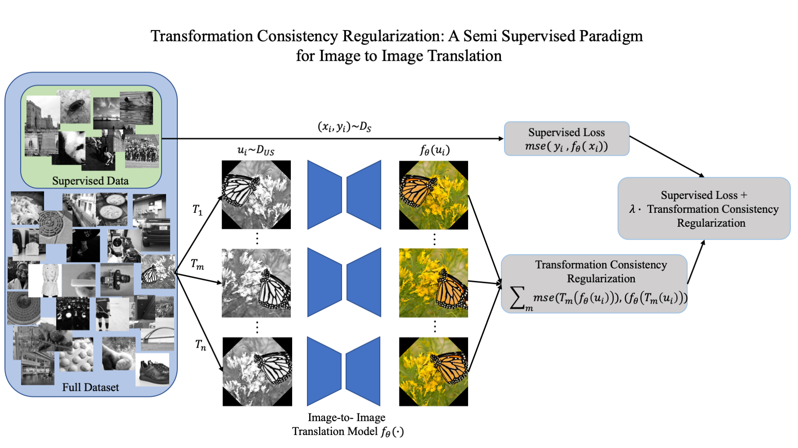

# Transformation Consistency Regularization- A Semi Supervised Paradigm for Image to Image Translation (ECCV'20)



This repository is an PyTorch implementation of the ECCV'20 paper [Transformation Consistency Regularization- A Semi Supervised Paradigm for Image to Image Translation](https://arxiv.org/abs/2007.07867).

In this work, we propose Transformation Consistency Regularization (TCR), as a Semi-Supervised Learning Method for Image-to-Image Translation. The method introduces a set of geometric transformations and enforces the model's predictions for unlabeled data to be invarient to these transformations. The above figure shows an illustrative example of the working of our method for the task of Image Colorization.

To this end, our method only requires around 10-20 % of the labeled data to achieve similar reconstructions to its fully-supervised counterpart.

We provide scripts to reproduce the results of our paper.

## Dependencies

* Python 3.6
* Pytorch >= 0.4.0
* Kornia


## Clone the repository
Clone this repository into any place you want.
```bash
git clone https://github.com/aamir-mustafa/Tranformation-CR
cd Tranformation-CR
```

## Files

``train.py`` -- For training the baseline model.

``train_tcr.py`` -- For training the model alongside Transformation Consistency Regularization (TCR) with MSE Loss.

``train_tcr_vgg_loss.py`` -- For training the model alongside Transformation Consistency Regularization (TCR) with VGG + MSE Loss.

``train_augmentation.py`` -- For training the model with image augmentation.

For details about each method, please refer to [our paper](https://arxiv.org/abs/2007.07867).


## Downloading the dataset 

Download the [BSD500 dataset](https://www2.eecs.berkeley.edu/Research/Projects/CS/vision/bsds/). For training the model, we use crops from the 400 training images, and evaluating on crops of the 100 test images. 

The downloaded train dataset lies in ``dataset/BSD500/images/train``.

The downloaded test dataset lies in ``dataset/BSD500/images/test``


## Example Usage:

### Training

`python train_tcr.py --upscale_factor 3 --batchSize 4 --testBatchSize 100 --nEpochs 500 --lr 0.001`

* The trained checkpoints will be saved in ``models/TCR`` folder.
* Output Super-Resolved Images will be saved in ``output/TCR`` folder.

### Other Methods

`python train.py` Training using baseline model.

`python train_augmentaion.py` Training using our transformations as Data Augmentation.

`python train_tcr_vgg_loss.py` Training using our transformations alongisde the Perceptual Loss.

* Checkpoints and the Output Images are saved in a similar fashion as above.


### Testing on your own images

You can run our trained model to Super-Resolve any set of images.

`python super_resolve.py --test_path dataset_folder --model TCR/model_epoch_500.pth --output_folder SR_Images`


